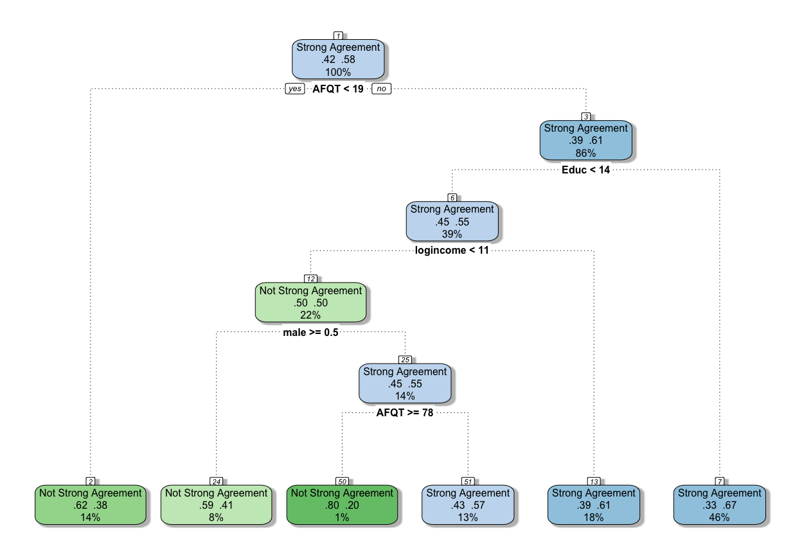

# YifanHomework6
Yifan Zhong  
November 18, 2015  
##Install packages

```r
library(Sleuth3) #dataset
library(doBy) #summaryBy
```

```
## Loading required package: survival
```

```r
library(caret) #confusion table
```

```
## Loading required package: lattice
## Loading required package: ggplot2
## 
## Attaching package: 'caret'
## 
## The following object is masked from 'package:survival':
## 
##     cluster
```

```r
library(HiDimDA) #LDA 
library(klaR) #RDA
```

```
## Loading required package: MASS
```

```r
library(rpart) #Tree
library(rattle)					# Fancy tree plot
```

```
## Rattle: A free graphical interface for data mining with R.
## Version 4.0.0 Copyright (c) 2006-2015 Togaware Pty Ltd.
## Type 'rattle()' to shake, rattle, and roll your data.
```

```r
library(rpart.plot)				# Enhanced tree plots
library(RColorBrewer)				# Color selection for fancy tree plot
```


##Data Manipulating

**T**he variable Esteem1 in the data set “ex1223.csv” has values 1, 2, 3, 4 based on the answer to the question “I feel I am a person of worth”
Construct a new binary variable from this variable, which takes the value 1 for strong agreement and 0 for agreement, disagreement, or strong disagreement.


```r
selfesteem <- ex1223
selfesteem$logincome <- log(selfesteem$Income2005)
selfesteem$male <- 1
selfesteem$male[which(selfesteem$Gender=="female")] <- 0
selfesteem$se <- 0
selfesteem$se[which(selfesteem$Esteem1==1)] <- 1
selfesteem <- selfesteem[,c("male","AFQT","logincome","Educ","se")]
selfesteem$se_group <- "Strong Agreement"
selfesteem$se_group[which(selfesteem$se==0)]<-"Not Strong Agreement"
selfesteem$se_group <- as.factor(selfesteem$se_group)
```

**Get the dataset profile.**


```r
head(selfesteem)
```

```
##   male   AFQT logincome Educ se             se_group
## 1    0  6.841  8.612503   12  1     Strong Agreement
## 2    1 99.393 11.082143   16  0 Not Strong Agreement
## 3    1 47.412  9.852194   12  0 Not Strong Agreement
## 4    0 44.022 10.491274   14  1     Strong Agreement
## 5    1 59.683 11.082143   14  1     Strong Agreement
## 6    1 72.313  8.987197   16  1     Strong Agreement
```

```r
str(selfesteem)
```

```
## 'data.frame':	2584 obs. of  6 variables:
##  $ male     : num  0 1 1 0 1 1 0 1 1 0 ...
##  $ AFQT     : num  6.84 99.39 47.41 44.02 59.68 ...
##  $ logincome: num  8.61 11.08 9.85 10.49 11.08 ...
##  $ Educ     : int  12 16 12 14 14 16 13 13 13 17 ...
##  $ se       : num  1 0 0 1 1 1 0 0 0 1 ...
##  $ se_group : Factor w/ 2 levels "Not Strong Agreement",..: 2 1 1 2 2 2 1 1 1 2 ...
```

```r
summaryBy(male+ AFQT + logincome+Educ~se,data=selfesteem)
```

```
##   se male.mean AFQT.mean logincome.mean Educ.mean
## 1  0 0.5111732  48.62412       10.29764  13.38175
## 2  1 0.5013245  58.57095       10.53731  14.25298
```


##Split trainning and testing data sets


```r
## 75% to the trainning dataset size
train_size <- round(0.75 * nrow(selfesteem))

set.seed(1992)
train_row <- sample(1:nrow(selfesteem), size = train_size)

train <- selfesteem[train_row, ]
test <- selfesteem[-train_row, ]

#compare train and test
summaryBy(male+ AFQT + logincome+Educ~se,data=selfesteem)
```

```
##   se male.mean AFQT.mean logincome.mean Educ.mean
## 1  0 0.5111732  48.62412       10.29764  13.38175
## 2  1 0.5013245  58.57095       10.53731  14.25298
```

```r
summaryBy(male+ AFQT + logincome+Educ~se,data=train)
```

```
##   se male.mean AFQT.mean logincome.mean Educ.mean
## 1  0 0.5239852  48.44686       10.28062  13.40098
## 2  1 0.4960000  58.31117       10.53921  14.26311
```

```r
summaryBy(male+ AFQT + logincome+Educ~se,data=test)
```

```
##   se male.mean AFQT.mean logincome.mean Educ.mean
## 1  0 0.4712644  49.17629       10.35065  13.32184
## 2  1 0.5168831  59.33003       10.53176  14.22338
```

```r
#acceptible, no clusters
```

**B**ased on three tables above, we can see that there is no clusters within trainning or testing data sets. The observations can be seen as being uniformly splited into trainning and testing data sets.


##Logistic regression

**Explore the dependence of the probability that a person has positive self-esteem on log annual income (Income2005), intelligence (AFQT), years of education (educ), and gender (data= ex1223.csv)**


```r
reg_se <- glm(se ~ male+AFQT+logincome+Educ, data=train,family = "binomial")
summary(reg_se)
```

```
## 
## Call:
## glm(formula = se ~ male + AFQT + logincome + Educ, family = "binomial", 
##     data = train)
## 
## Deviance Residuals: 
##     Min       1Q   Median       3Q      Max  
## -1.7941  -1.2191   0.8146   1.0468   1.6094  
## 
## Coefficients:
##             Estimate Std. Error z value Pr(>|z|)    
## (Intercept) -3.10082    0.55712  -5.566 2.61e-08 ***
## male        -0.23415    0.10057  -2.328 0.019896 *  
## AFQT         0.00733    0.00214   3.426 0.000613 ***
## logincome    0.20792    0.05332   3.899 9.64e-05 ***
## Educ         0.07151    0.02454   2.914 0.003568 ** 
## ---
## Signif. codes:  0 '***' 0.001 '**' 0.01 '*' 0.05 '.' 0.1 ' ' 1
## 
## (Dispersion parameter for binomial family taken to be 1)
## 
##     Null deviance: 2636.2  on 1937  degrees of freedom
## Residual deviance: 2546.3  on 1933  degrees of freedom
## AIC: 2556.3
## 
## Number of Fisher Scoring iterations: 4
```

```r
confint.default(reg_se)
```

```
##                    2.5 %      97.5 %
## (Intercept) -4.192755454 -2.00888679
## male        -0.431253922 -0.03704174
## AFQT         0.003136274  0.01152342
## logincome    0.103413392  0.31242501
## Educ         0.023413397  0.11960779
```

```r
exp(cbind(OR = coef(reg_se), confint(reg_se)))
```

```
## Waiting for profiling to be done...
```

```
##                     OR      2.5 %    97.5 %
## (Intercept) 0.04501223 0.01498237 0.1332972
## male        0.79124484 0.64940526 0.9633205
## AFQT        1.00735678 1.00314706 1.0115995
## logincome   1.23111369 1.10943265 1.3677814
## Educ        1.07412953 1.02386754 1.1273088
```

**F**rom the outputs above, we see that all the coefficients in the model is statistically significant under alpha level of 0.05, therefore the model is fitted as :

logit(self esteem)=-3.10082 - 0.23415\*male + 0.00733\*AFQT + 0.20792\*logincome + 0.07151\*Educ 

The estimates of parameter associated with odd ratio is the last part of output, for example, the estimated mean of odd ratio for the male is 0.7912 higher than that for the female, and the estimated mean of odd ratio will be 1.2311 higher if the logincome is increased by one unit. 


```r
attach(test)
pred_reg <- NULL
pred_reg$logit <- -3.10082 - 0.23415*male + 0.00733*AFQT + 0.20792*logincome + 0.07151*Educ
pred_reg$or <- exp(pred_reg$logit)
pred_reg <- data.frame(pred_reg)
pred_reg$se_group <- "Strong Agreement"
#odd ratio <1 means pr(Strong)<pr(Not Strong), we can predict it as "Not strong agreement"
pred_reg$se_group[which(pred_reg$or<1)] <- "Not Strong Agreement"
pred_reg$se_group <- as.factor(pred_reg$se_group)
detach(test)
confusionMatrix(pred_reg$se_group,test$se_group,positive = "Strong Agreement")
```

```
## Confusion Matrix and Statistics
## 
##                       Reference
## Prediction             Not Strong Agreement Strong Agreement
##   Not Strong Agreement                   74               65
##   Strong Agreement                      187              320
##                                           
##                Accuracy : 0.6099          
##                  95% CI : (0.5711, 0.6477)
##     No Information Rate : 0.596           
##     P-Value [Acc > NIR] : 0.2482          
##                                           
##                   Kappa : 0.124           
##  Mcnemar's Test P-Value : 2.492e-14       
##                                           
##             Sensitivity : 0.8312          
##             Specificity : 0.2835          
##          Pos Pred Value : 0.6312          
##          Neg Pred Value : 0.5324          
##              Prevalence : 0.5960          
##          Detection Rate : 0.4954          
##    Detection Prevalence : 0.7848          
##       Balanced Accuracy : 0.5573          
##                                           
##        'Positive' Class : Strong Agreement
## 
```

**F**rom the confusion table above, we see the logistic regression model, using all the predictors, has **0.6099** accuracy and **0.5573** balanced accuracy on the testing data sets with 95% confidence interval for accuracy is (0.5711, 0.6477).

##LDA classification


```r
ldarule <- Dlda(train[,c(1,2,3,4)],train$se_group)   
# show classification rule
print(ldarule)
```

```
## Call:
## Dlda.data.frame(data = train[, c(1, 2, 3, 4)], train$se_group)
## 
## Prior probabilities of groups:
## Not Strong Agreement     Strong Agreement 
##            0.4195046            0.5804954 
## 
## Group means:
##                           male     AFQT logincome     Educ
## Not Strong Agreement 0.5239852 48.44686  10.28062 13.40098
## Strong Agreement     0.4960000 58.31117  10.53921 14.26311
## 
## Coefficients of linear discriminants:
##                   LD1
## male       0.19625036
## AFQT      -0.02301903
## logincome -0.47238361
## Educ      -0.25016216
## 
## Variables kept in discriminant rule:
## [1] "male"      "AFQT"      "logincome" "Educ"     
## Number of variables kept: 4
```

```r
# get in-sample classification results
invisible(pred_lda <- predict(ldarule,test[,c(1,2,3,4)],grpcodes=levels(test$se_group))$class)           	       

confusionMatrix(pred_lda,test$se_group,positive = "Strong Agreement")
```

```
## Confusion Matrix and Statistics
## 
##                       Reference
## Prediction             Not Strong Agreement Strong Agreement
##   Not Strong Agreement                  118              100
##   Strong Agreement                      143              285
##                                           
##                Accuracy : 0.6238          
##                  95% CI : (0.5852, 0.6613)
##     No Information Rate : 0.596           
##     P-Value [Acc > NIR] : 0.079884        
##                                           
##                   Kappa : 0.1976          
##  Mcnemar's Test P-Value : 0.007054        
##                                           
##             Sensitivity : 0.7403          
##             Specificity : 0.4521          
##          Pos Pred Value : 0.6659          
##          Neg Pred Value : 0.5413          
##              Prevalence : 0.5960          
##          Detection Rate : 0.4412          
##    Detection Prevalence : 0.6625          
##       Balanced Accuracy : 0.5962          
##                                           
##        'Positive' Class : Strong Agreement
## 
```

**F**rom the output, the LDA method also uses all the predictors in the model. The model has **0.6238** accuracy and **0.5962** balanced accuracy on the testing dataset with 95% confidence interval for accuracy is (0.5852, 0.6613)

##RDA classification


```r
rdarule <- rda(se_group~male+AFQT+logincome+Educ,data=train)
print(rdarule) 
```

```
## Call: 
## rda(formula = se_group ~ male + AFQT + logincome + Educ, data = train)
## 
## Regularization parameters: 
##      gamma     lambda 
## 0.05892258 0.35774791 
## 
## Prior probabilities of groups: 
## Not Strong Agreement     Strong Agreement 
##            0.4195046            0.5804954 
## 
## Misclassification rate: 
##        apparent: 38.648 %
## cross-validated: 38.436 %
```

```r
pred_rda <- predict(rdarule,test[,c(1,2,3,4)],grpcodes=levels(test$se_group))$class
confusionMatrix(pred_rda,test$se_group,positive = "Strong Agreement")
```

```
## Confusion Matrix and Statistics
## 
##                       Reference
## Prediction             Not Strong Agreement Strong Agreement
##   Not Strong Agreement                   56               47
##   Strong Agreement                      205              338
##                                           
##                Accuracy : 0.6099          
##                  95% CI : (0.5711, 0.6477)
##     No Information Rate : 0.596           
##     P-Value [Acc > NIR] : 0.2482          
##                                           
##                   Kappa : 0.1025          
##  Mcnemar's Test P-Value : <2e-16          
##                                           
##             Sensitivity : 0.8779          
##             Specificity : 0.2146          
##          Pos Pred Value : 0.6225          
##          Neg Pred Value : 0.5437          
##              Prevalence : 0.5960          
##          Detection Rate : 0.5232          
##    Detection Prevalence : 0.8406          
##       Balanced Accuracy : 0.5462          
##                                           
##        'Positive' Class : Strong Agreement
## 
```

**F**rom the output, the RDA method also uses all the predictors in the model. The model has **0.6099** accuracy and **0.5462** balanced accuracy on the testing dataset with 95% confidence interval for accuracy is (0.5711, 0.6477)

##Decesion Tree


```r
tree <- rpart(se_group~male+AFQT+logincome+Educ,data=train,method="class")
par(mar = rep(2, 4))
fancyRpartPlot(tree)
```

 

```r
print(tree)
```

```
## n= 1938 
## 
## node), split, n, loss, yval, (yprob)
##       * denotes terminal node
## 
##  1) root 1938 813 Strong Agreement (0.4195046 0.5804954)  
##    2) AFQT< 19.01 277 105 Not Strong Agreement (0.6209386 0.3790614) *
##    3) AFQT>=19.01 1661 641 Strong Agreement (0.3859121 0.6140879)  
##      6) Educ< 13.5 763 345 Strong Agreement (0.4521625 0.5478375)  
##       12) logincome< 10.52538 421 209 Not Strong Agreement (0.5035629 0.4964371)  
##         24) male>=0.5 158  65 Not Strong Agreement (0.5886076 0.4113924) *
##         25) male< 0.5 263 119 Strong Agreement (0.4524715 0.5475285)  
##           50) AFQT>=78.0575 15   3 Not Strong Agreement (0.8000000 0.2000000) *
##           51) AFQT< 78.0575 248 107 Strong Agreement (0.4314516 0.5685484) *
##       13) logincome>=10.52538 342 133 Strong Agreement (0.3888889 0.6111111) *
##      7) Educ>=13.5 898 296 Strong Agreement (0.3296214 0.6703786) *
```

```r
pred_tree <- predict(tree,test[,c(1,2,3,4)],grpcodes=levels(test$se_group),type="class")

confusionMatrix(pred_tree,test$se_group,positive = "Strong Agreement")
```

```
## Confusion Matrix and Statistics
## 
##                       Reference
## Prediction             Not Strong Agreement Strong Agreement
##   Not Strong Agreement                   74               79
##   Strong Agreement                      187              306
##                                           
##                Accuracy : 0.5882          
##                  95% CI : (0.5492, 0.6265)
##     No Information Rate : 0.596           
##     P-Value [Acc > NIR] : 0.6711          
##                                           
##                   Kappa : 0.0839          
##  Mcnemar's Test P-Value : 5.359e-11       
##                                           
##             Sensitivity : 0.7948          
##             Specificity : 0.2835          
##          Pos Pred Value : 0.6207          
##          Neg Pred Value : 0.4837          
##              Prevalence : 0.5960          
##          Detection Rate : 0.4737          
##    Detection Prevalence : 0.7632          
##       Balanced Accuracy : 0.5392          
##                                           
##        'Positive' Class : Strong Agreement
## 
```


**F**rom the output, the decesion tree method also uses all the predictors in the model. The model has **0.5882** accuracy and **0.5392** balanced accuracy on the testing dataset with 95% confidence interval for accuracy is (0.5492, 0.6265)

##Summary

To summarize, since all the models indicate that all the predictors should be included in the model, we need to obtain all four predictors to fit the model.
And among Logistic regression, LDA, RDA, Decesion Tree, the LDA method provides the best predictions with **0.6238** accuracy and **0.5962** balanced accuracy on the testing datasets.

Therefore, we prefer to use LDA classifier to do the prediction.
