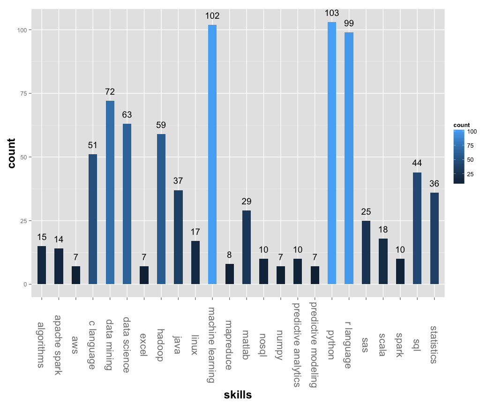
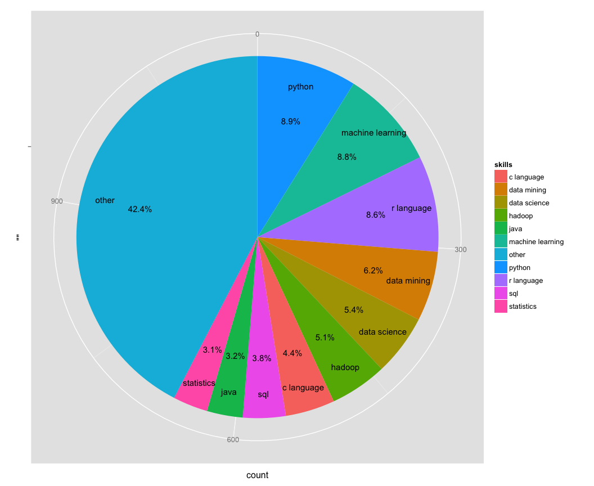

# CaseStudy2
Yifan ZHong  
October 9, 2015  
# Case Study II: Using Data Science to Define Data Science
# Due Date: November 10, 2015

## **Overview**
<span style="color:red">We scraped all the "data science" jobs on Cybercoders.com, including all the 8 pages with total of over 100 job posts. The purpose is to summarize the preferred skills for "data science" jobs and use our findings to define what a data scientist does, and thereby define "data science".</span>


### The Code
 We will make a separate function for each step, which should make the functions easier to read, test, maintain, and adjust as the format of the web pages changes. The function `cy.getFreeFormWords()` below fetches the lists of free-form text in the HTML document. The function then decomposes the text into the words in each element, using spaces and punctuation characters to separate them. This is done by calling the `asWords()` function. One of the arguements for `asWords()` is a list of "stop words", which are small words that are present in a large number of English sentences. We don't want to include these words in our list of post words. Finally, a call to `removeStopWords()` removes all stop words from the post, so that we have only the words that carry meaning for the job seeker (well, almost).

```r
require(XML)
```

```
## Loading required package: XML
```

```r
require(RCurl)
```

```
## Loading required package: RCurl
## Loading required package: bitops
```

```r
require(ggplot2)
```

```
## Loading required package: ggplot2
```

```r
require(scales)
```

```
## Loading required package: scales
```

```r
#library(wesanderson)
```


```r
StopWords = readLines("http://jmlr.csail.mit.edu/papers/volume5/lewis04a/a11-smart-stop-list/english.stop")

asWords = function(txt, stopWords = StopWords, stem = FALSE)
{
  words = unlist(strsplit(txt, '[[:space:]!.,;#:()/"]+'))
  words = words[words != ""]
  if(stem && require(Rlibstemmer))
     words = wordStem(words)
  i = tolower(words) %in% tolower(stopWords)
  words[!i]
}

removeStopWords = function(x, stopWords = StopWords) 
     {
         if(is.character(x))
             setdiff(x, stopWords)
         else if(is.list(x))
             lapply(x, removeStopWords, stopWords)
         else
             x
     }

cy.getFreeFormWords = function(doc, stopWords = StopWords)
     {
         nodes = getNodeSet(doc, "//div[@class='job-details']/
                                 div[@data-section]")
         if(length(nodes) == 0) 
             nodes = getNodeSet(doc, "//div[@class='job-details']//p")
         
         if(length(nodes) == 0) 
             warning("did not find any nodes for the free form text in ",
                     docName(doc))
         
         words = lapply(nodes,
                        function(x)
                            strsplit(xmlValue(x), 
                                     "[[:space:][:punct:]]+"))
         
         removeStopWords(words, stopWords)
     }
```

### Question 1: Implement the following functions. Use the code we explored to extract the date posted, skill sets and salary and location information from the parsed HTML document.
After testing the function in the console window, already understood how it works and am able to modify it. To keep the report neat, suppress the work.


```r
cy.getSkillList = function(doc)
{
  lis = getNodeSet(doc, "//div[@class = 'skills-section']//
                         li[@class = 'skill-item']//
                         span[@class = 'skill-name']")

  sapply(lis, xmlValue)
}

cy.getDatePosted = function(doc)
  { xmlValue(getNodeSet(doc, 
                     "//div[@class = 'job-details']//
                        div[@class='posted']/
                        span/following-sibling::text()")[[1]],
    trim = TRUE) 
}

cy.getLocationSalary = function(doc)
{
  ans = xpathSApply(doc, "//div[@class = 'job-info-main'][1]/div", xmlValue)
  names(ans) = c("location", "salary")
  ans
}

# cy.getSkillList(cydoc)
# cy.getLocationSalary(cydoc)
```

The function `cy.ReadPost()` given below reads each job post. This function implements three other functions: `cy.getFreeFormWords()`, `cy.getSkillList()`, and `cy.getLocationSalary()`.


```r
cy.readPost = function(u, stopWords = StopWords, doc = htmlParse(u))
  {
    ans = list(words = cy.getFreeFormWords(doc, stopWords),
         datePosted = cy.getDatePosted(doc),
         skills = cy.getSkillList(doc))
    o = cy.getLocationSalary(doc)
    ans[names(o)] = o
    ans
}
# cyFuns = list(readPost = function(u, stopWords = StopWords, doc=htmlParse(u)))
```
### Reading posts programmatically
The function `cy.ReadPost()` allows us to read a single post from CyberCoders.com in a very general format. All we need is the URL for the post. Now, let's see about obtaining the URLs using a computer program.


```r
# Obtain URLs for job posts
txt = getForm("http://www.cybercoders.com/search/", searchterms = '"Data Scientist"',
              searchlocation = "",  newsearch = "true", sorttype = "")
# Parse the links
doc = htmlParse(txt, asText = TRUE)
links = getNodeSet(doc, "//div[@class = 'job-title']/a/@href")
# Save the links in the vector joblinks
joblinks <- getRelativeURL(as.character(links), "http://www.cybercoders.com/search/")
# Read the posts
posts <- lapply(joblinks,cy.readPost)

cy.getPostLinks = function(doc, baseURL = "http://www.cybercoders.com/search/") 
  {
    if(is.character(doc)) doc = htmlParse(doc)
    links = getNodeSet(doc, "//div[@class = 'job-title']/a/@href") 
    getRelativeURL(as.character(links), baseURL)
}

cy.readPagePosts = function(doc, links = cy.getPostLinks(doc, baseURL),
baseURL = "http://www.cybercoders.com/search/")
  {
    if(is.character(doc)) doc = htmlParse(doc)
    lapply(links, cy.readPost)
 }

## Testing the function with the parsed version of the first page of results in object doc
posts = cy.readPagePosts(doc)
sapply(posts,`[[`, "salary")
```

```
##           /data-scientist-job-214172           /data-scientist-job-200988 
##            "Full-time $100k - $160k"            "Full-time $100k - $160k" 
##           /data-scientist-job-184567           /data-scientist-job-230442 
##            "Full-time $130k - $160k"            "Full-time $140k - $160k" 
##           /data-scientist-job-234161           /data-scientist-job-223862 
## "Full-time Compensation Unspecified" "Full-time Compensation Unspecified" 
##           /data-scientist-job-230135           /data-scientist-job-235549 
## "Full-time Compensation Unspecified"            "Full-time $120k - $150k" 
##           /data-scientist-job-232102           /data-scientist-job-193909 
##            "Full-time $100k - $160k"            "Full-time $110k - $150k" 
##           /data-scientist-job-199692           /data-scientist-job-221652 
## "Full-time Compensation Unspecified"             "Full-time $75k - $150k" 
##           /data-scientist-job-224228           /data-scientist-job-227142 
##            "Full-time $100k - $150k"            "Full-time $100k - $130k" 
##           /data-scientist-job-227433           /data-scientist-job-227439 
##             "Full-time $75k - $100k"            "Full-time $120k - $140k" 
##           /data-scientist-job-227443           /data-scientist-job-233385 
##             "Full-time $90k - $110k"            "Full-time $110k - $150k" 
##           /data-scientist-job-147098           /data-scientist-job-227151 
##            "Full-time $120k - $150k"             "Full-time $90k - $110k"
```

```r
summary(sapply(posts, function(x) length(unlist(x$words))))
```

```
##    Min. 1st Qu.  Median    Mean 3rd Qu.    Max. 
##    66.0    99.0   121.0   143.0   173.5   338.0
```

**Question:** Test the `cy.getFreeFormWords()` function on several different posts.

<span style="color:red">After testing the function in the console window, already understood how it works and am able to modify it. To keep the report neat, suppress the work.</span>

The following code chunk pulls it all together. The function `cy.getNextPageLink()` retrieves each page from CyberCoders and calls the other functions to parse each post in order to obtain information such as salary, skills, and location.


```r
# Test of concept
# getNodeSet(doc, "//a[@rel='next']/@href")[[1]]
## A function to get all pages
cy.getNextPageLink = function(doc, baseURL = docName(doc))
{
  if(is.na(baseURL))
     baseURL = "http://www.cybercoders.com/"
  link = getNodeSet(doc, "//li[@class = 'lnk-next pager-item ']/a/@href")
  if(length(link) == 0)
    return(character())
    link2 <- gsub("./", "search/",link[[1]])
 getRelativeURL(link2, baseURL)
}

# Test the above function
tmp = cy.getNextPageLink(doc, "http://www.cybercoders.com")
```

Now we have all we need to retrieve all job posts on Cyber Coders for a given search query. The following function puts it all together into a function that we can call with a search string for a job of interest. The function submits the initial query and then reads the posts from each result page.

```r
cyberCoders =
function(query)
{
   txt = getForm("http://www.cybercoders.com/search/",
                  searchterms = query,  searchlocation = "",
                  newsearch = "true",  sorttype = "")
   doc = htmlParse(txt)

   posts = list()
   while(TRUE) {
       posts = c(posts, cy.readPagePosts(doc))
       nextPage = cy.getNextPageLink(doc)
       if(length(nextPage) == 0)
          break

       nextPage = getURLContent(nextPage)
       doc = htmlParse(nextPage, asText = TRUE)
   }
   invisible(posts)
}
```


### **The function cyberCoders is called below with the skill "Data Scientist". Then, we sort the skills and obtain all skills that are mentioned more than twice in the list.**

Your first job from here is to clean up the skills list using regular expressions. You should explain which categories you combined and justify your decisions for combining categories in the R Markdown document. For help, see `help(regex)` and slides from class meetings 12 and 13 on BB.

```r
dataSciPosts <- cyberCoders("Data Scientist")
skillpost0 <- unlist(lapply(dataSciPosts, `[[`, "skills")) #origin skill list
skillpost2 <- tolower(skillpost0) #convert upper case into lower case
skillpost2 <- unlist(strsplit(skillpost2,",|, |;|; |&| & |/| / |/ | or | and | and/or | or/and ")) # skill list clean (i.e. split A/B into A and B)
```

**combine**
<span style="color:red">combine the followings into their own category, reduce multiple tags standing for the same skill.</span>


```r
skillpost2[which(unname(sapply(skillpost2,pmatch,x="c"))==1)] <- "c language"
skillpost2[which(unname(sapply(skillpost2,pmatch,x="r"))==1)] <- "r language"
skillpost2[which(unname(sapply(skillpost2,pmatch,x="sql"))==1)] <- "sql"
skillpost2[which(unname(sapply(skillpost2,pmatch,x="hadoop"))==1)] <- "hadoop"
skillpost2[which(unname(sapply(skillpost2,pmatch,x="visualization"))==1)] <- "visualization"
skillpost2[which(unname(sapply(skillpost2,pmatch,x="machine learning"))==1)] <- "machine learning"
skillpost2[which(unname(sapply(skillpost2,pmatch,x="excel"))==1)] <- "excel"
skillpost2[which(unname(sapply(skillpost2,pmatch,x="spark"))==1)] <- "spark"
#skillpost2[which(unname(sapply(skillpost2,pmatch,x="algorithms"))==1)] <- "algorithms"
```
<span style="color:red">
combine the following into one single category called "data science". Since data science including data cleaning, manipulating, modeling and analysis. Those followings do not specify which particular skills are required, therefore put them into "data science". </span>


```r
#data analysis
skillpost2[which(unname(sapply(skillpost2,pmatch,x="data science"))==1)] <- "data science"
skillpost2[which(unname(sapply(skillpost2,pmatch,x="data scientist"))==1)] <- "data science"
skillpost2[which(unname(sapply(skillpost2,pmatch,x="big data"))==1)] <- "data science"
skillpost2[which(unname(sapply(skillpost2,pmatch,x="data sets"))==1)] <- "data science"
skillpost2[which(unname(sapply(skillpost2,pmatch,x="data analysis"))==1)] <- "data science"
skillpost2[which(unname(sapply(skillpost2,pmatch,x="data modeling"))==1)] <- "data science"

#we here use function grepl instead of pmatch for the reason that there may not be a space between the strings. i.e. we cannot extract java from javascript if we use function pmatch
skillpost2[grepl("statistic", skillpost2)] <- "statistics"
skillpost2[grepl("java", skillpost2)] <- "java"


skills = sort(table(skillpost2), decreasing = TRUE )
```


Once you have your files cleaned up, your second assignment is to create visualizations of the skils required, and interpret those visualizations.


```r
skills.df <- data.frame(skills[skills>6])
names(skills.df) <- "count"
skills.df$skills <- attributes(skills.df)$row.names
skills.df
```

```
##                      count               skills
## python                 103               python
## machine learning       102     machine learning
## r language              99           r language
## data mining             72          data mining
## data science            63         data science
## hadoop                  59               hadoop
## c language              51           c language
## sql                     44                  sql
## java                    37                 java
## statistics              36           statistics
## matlab                  29               matlab
## sas                     25                  sas
## scala                   18                scala
## linux                   17                linux
## algorithms              15           algorithms
## apache spark            14         apache spark
## nosql                   10                nosql
## predictive analytics    10 predictive analytics
## spark                   10                spark
## mapreduce                8            mapreduce
## aws                      7                  aws
## excel                    7                excel
## numpy                    7                numpy
## predictive modeling      7  predictive modeling
```

<span style="color:red">
From the table above, we display how many times the particular skills are required by an employers in all of the job posts.
And it shows that the top 5 skills are: machine learning, python, r language, data mining, data science. The times they were required among all 148 job posts are: 102, 99, 97, 72 and 62, seperately. (these numbers may vary a little due to the new job post or expired old job post)
</span>


```r
#histogram
ggplot(skills.df,aes(y=count,x=skills,fill=count,width=0.5))+
       geom_histogram(stat="identity")+
       geom_text(aes(label=count,vjust=-1))+
       theme(axis.text.x=element_text(angle=-90,size=16,vjust=0.5),
             axis.title=element_text(size=18,face="bold"))
```

 

```r
#pie chart
skills.pc <- data.frame(skills)
names(skills.pc)<-"count"
skills.pc$skills <- attributes(skills.pc)$row.names
other.id <- NULL
other.sum <- 0
for (i in 1:dim(skills.pc$count)) 
{
    if (skills.pc$count[i] < 30) 
    {
      other.id <- c(other.id,i);
      other.sum <- as.integer(unname(other.sum + skills.pc$count[i]))
    }
      
}
skills.pc <- skills.pc[-other.id,]
skills.pc <- rbind.data.frame(skills.pc,c(other.sum,"other"))
skills.pc$count <- as.integer(skills.pc$count)
count.sum <- sum(skills.pc$count)

ggplot(skills.pc, aes(x = "", y = count, fill = skills)) +
  geom_bar(width = 1.5, stat = "identity") +
  coord_polar(theta="y")+
  geom_text(aes(x=1.25,y=(c(0,cumsum(count)[-length(count)])+cumsum(count))/2, 
            label = percent(count/count.sum)), size=4)+
   geom_text(aes(x=1.55,y=(c(0,cumsum(count)[-length(count)])+cumsum(count))/2, 
            label = skills), size=4)
```

 

##summary 

<span style="color:red">
After cleaning the data, we plot histogram grouped by different required skills. The histogram shows that among all the required skills, employers highly value programming skills like R Language, Python, Hadoop. Besides those, knowledges regarding of machine learning, data mining, and data science are also extremely important. ("data science" here is a general term of data gathering, data cleaning, data manipulating and data analysis.)
We also plot a pie chart of the percentage each skills in all the skills required by employers. From pie chart, we see among all the required skills, 9% are "machine learning", "r language", "python", seperately. 
Therefore, we can consider a data scientist is supposed to use computer programming languages to analyze data with the help of statistical knowledges. 
And data science is considered as gathering, cleaning, manipulating and analyzing data through computer programming with the help of statistical knowledges.
</span>


##Reference:
Code taken from Nolan, D. and Temple Lang. Data Science in R: A Case Studies Approach to Computational Reasoning and Problem Solving. CRC Press, 04/2015. VitalBook file.
